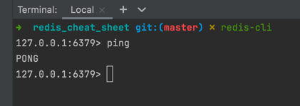
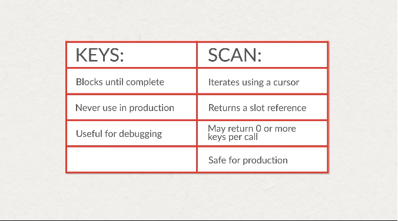

# Redis cheat sheet

Just a redis cheat sheet to help decrease the learning curve to use Redis

## Content

- [Recommended GUI](#recommended-gui)
- [Running Redis with Docker](#running-redis-with-docker)
- [Redis basic commands](#basic-commands)
    - [Insert string](#insert-string)
    - [Insert string with TTL](#insert-string-with-ttlhttpsenwikipediaorgwikitime_to_live-of-10-seconds)
    - [Insert string only if the key does not exist](#insert-string-only-if-the-key-does-not-exist)
    - [Insert string only if the key does exist](#insert-string-only-if-the-key-does-exist)
    - [Discover TTL of a key before it expires](#discover-ttl-of-a-key-before-it-expires)
    - [Check if a key exists](#check-if-a-key-exists-it-will-return-0-or-1)
    - [Increment or create a value](#increment-or-create-a-value-if-the-key-doesnt-exist)
    - [Increment a key by a specific value](#increment-a-key-by-a-specific-value---will-return-the-total-number)
    - [Delete one or more keys](#delete-one-or-more-keys---will-return-the-number-of-deleted-keys)
    - [Get all keys](#get-all-keys-of-a-giving-pattern)

### Recommended GUI

1. RedisInsight | [Link](https://redislabs.com/redis-enterprise/redis-insight/)

### Running redis with docker

1. Create a docker volume to store redis data:

```shell
docker volume create redis_data
```

2. Use the `docker-compose.yml` inside this project to run redis locally with:

```shell
docker compose up --build -d
```

3. Connect to redis using the CLI

```shell
redis-cli
```

4. Test your local connection with the `PING` command:



### Basic commands

##### Insert string:

```
SET users:101:timezone UTC-3
```

##### Insert string with [TTL](https://en.wikipedia.org/wiki/Time_to_live) of 10 seconds:

```
SET usage:63 '{"user": 123, "balance": 123}'  EX 10
```

##### Insert string only if the key does not exist

```
SET usage:63 '{"user": 124, "balance": 124}' NX # should not exists
```

##### Insert string only if the key does exist

```
SET usage:63 '{"user": 124, "balance": 124}' XX # should exists
```

##### Discover TTL of a key before it expires:

```
TTL usage:63
```

##### Check if a key exists. It will return `0` or `1`:

```
EXISTS user:23:visit-count
```

##### Increment or create a value if the key doesn't exist:

```
INCR user:23:visit-count
```

##### Increment a key by a specific value - will return the total number:

```
INCRBY user:23:visit-count 10
INCRBY user:23:visit-count -57
```

##### Delete one or more keys - will return the number of deleted keys:

```
DEL user:23:visit-count user:24:visit-count # blocking
UNLINK user:23:visit-count # non-blocking
```

##### Get all keys of a giving pattern

```
KEYS user:*
SCAN 0 MATCH user:*
SCAN 9 MATCH user:* COUNT 100
```



### Resources:

- [ ] [Try Redis](https://try.redis.io/)
- [X] [Redis Strings Explained](https://www.youtube.com/watch?v=n0LQREq4GrY&list=PLratyGi2ixLvYgh1fmCvwJwk8nc6y0gXr&index=2)
- [ ] [Redis Hashes Explained](https://www.youtube.com/watch?v=-agsJUihrWw&list=PLratyGi2ixLvYgh1fmCvwJwk8nc6y0gXr&index=2)
- [ ] [Redis Sets Explained](https://www.youtube.com/watch?v=6Pjz819sT7M&list=PLratyGi2ixLvYgh1fmCvwJwk8nc6y0gXr&index=5)
- [ ] [Redis Sorted Sets Explained](https://www.youtube.com/watch?v=XqSK-4oEoAc&list=PLratyGi2ixLvYgh1fmCvwJwk8nc6y0gXr&index=4)
- [ ] [Redis Bitmaps Explained](https://www.youtube.com/watch?v=5fmyc5lkwD4&list=PLratyGi2ixLvYgh1fmCvwJwk8nc6y0gXr&index=8)
- [ ] [Introduction to Redis Data Structures](https://university.redis.com/courses/ru101/)